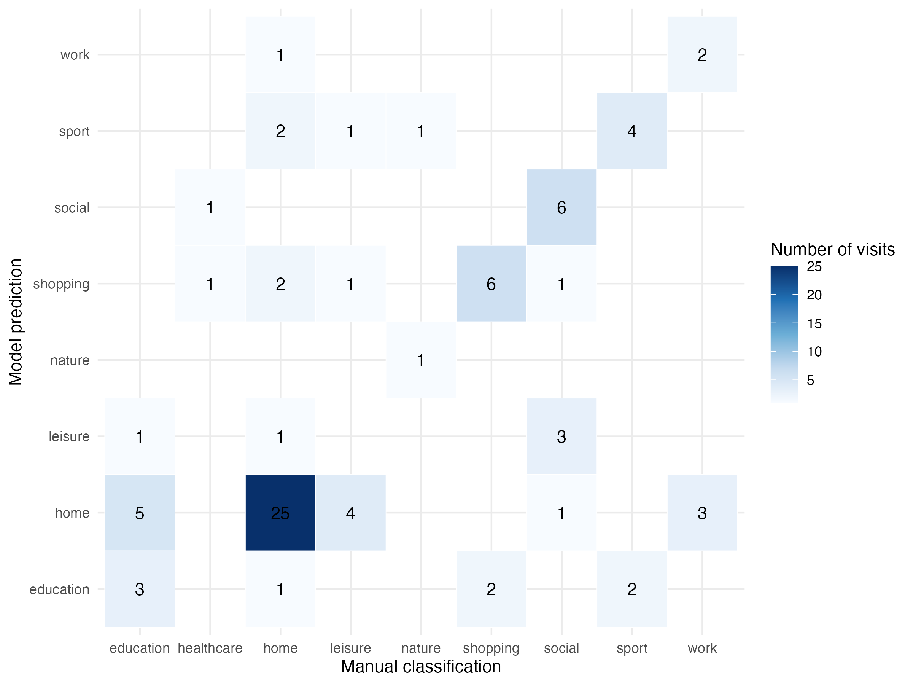
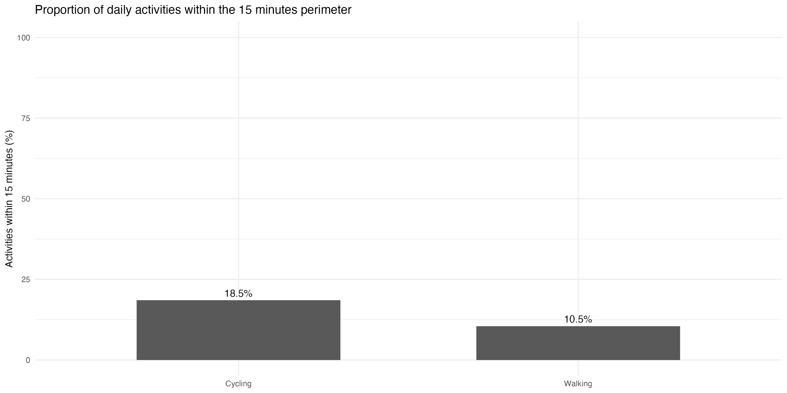
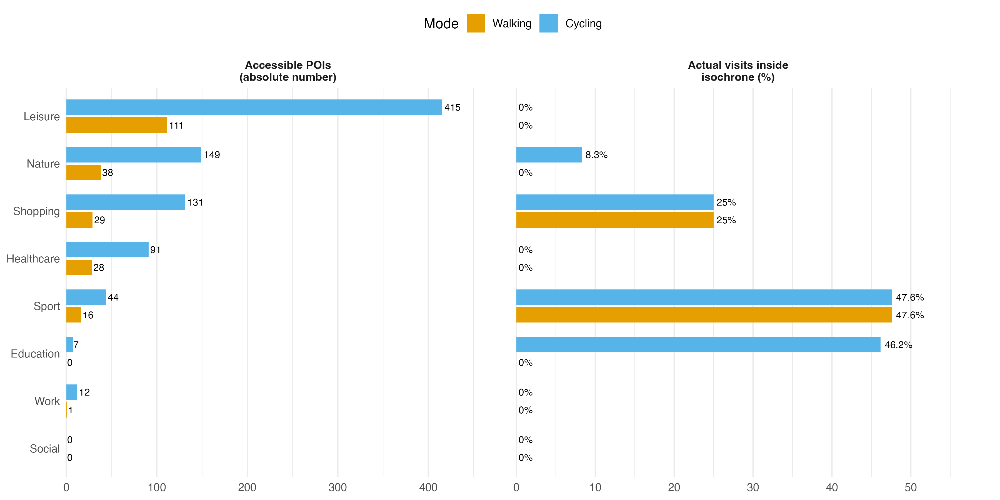
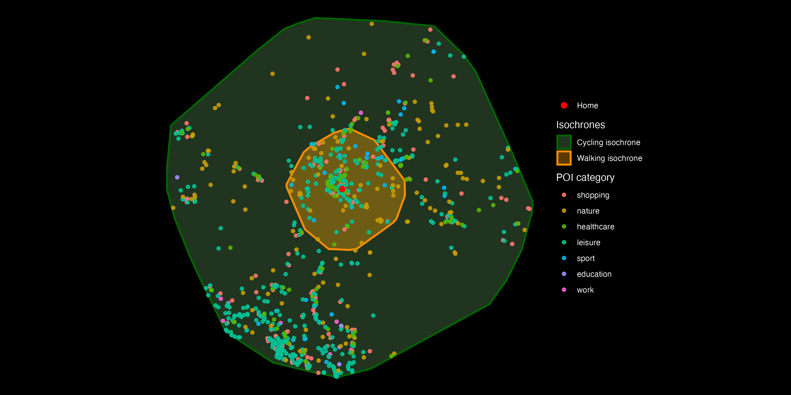
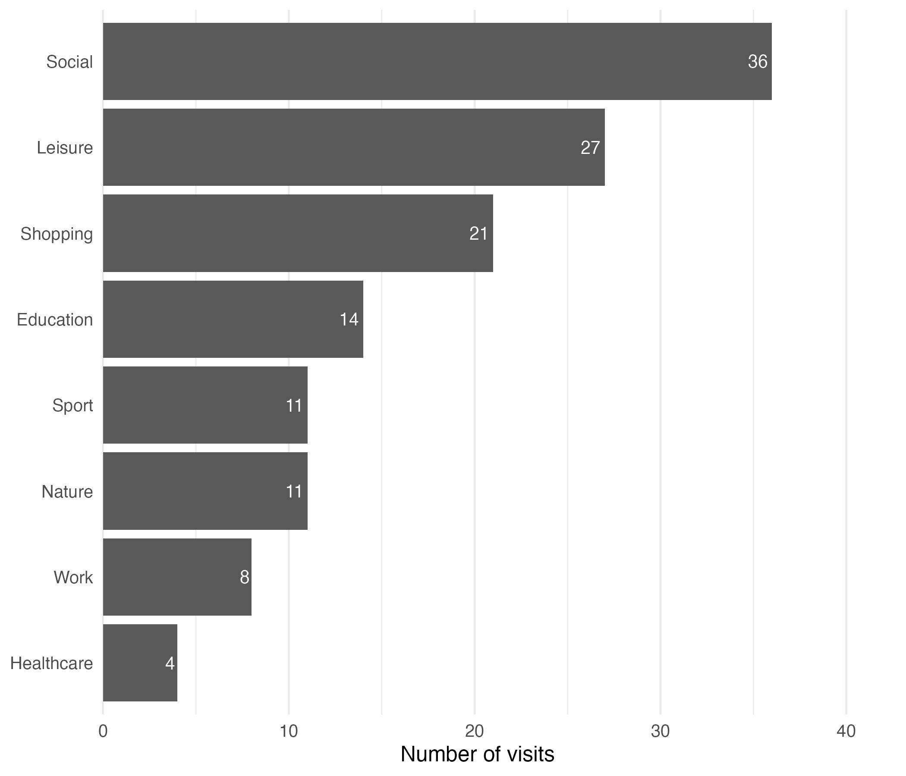

```{r preprocessing}
#| code-summary: preprocessing

``` 


## Abstract

The 15-minute city has emerged as an urban planning concept aimed at providing residents with access to essential daily needs within a short travel time using sustainable transport modes. However, the availability of nearby opportunities does not necessarily imply that these opportunities are used. This study investigates the relationship between theoretical accessibility and observed mobility behavior using a three-month personal mobility dataset collected through Google Timeline in Zurich, Switzerland.

Activity locations were manually classified into categories. Accessibility was modelled using OSM street networks and 15-minute isochrones for walking and cycling. POIs were used to quantify the opportunities theoretically accessible within each accessibility area. The distribution of observed activity patterns were subsequently compared with accessible opportunities.

The results reveal substantial differences between theoretical accessibility and actual destination choices. While several routine activities occurred within local accessibility areas, many leisure, social and nature-related activities extended beyond the 15-minute neighborhood. The findings suggest that accessibility alone is insufficient to explain mobility behavior. Social relationships, personal preferences, economic considerations and institutional constraints play important roles in shaping destination choices.

The study demonstrates that the 15-minute city should primarily be understood as an accessibility framework rather than a behavioral framework. Accessibility creates opportunities for local living, but actual mobility patterns remain influenced by a broader set of social and behavioral factors.

## Abreviations
OpenStreetMap = OSM

Point of Interest = POI 

## Introduction

Throughout the twentieth century, automobile-oriented urban development increased the spatial separation between residences and essential services, contributing to longer travel distances, congestion, environmental impacts, and reduced opportunities for active transportation. In response to these challenges, the concept of the 15-minute city has gained attention among urban planners and policymakers. Popularized by [@Moreno_2021], the concept proposes that residents should be able to access most daily needs within approximately fifteen minutes from home walking or cycling. The objective is not to restrict mobility, but rather to ensure that essential opportunities are available locally. By reducing dependence on long-distance travel, the 15-minute city aims to reduce car-dependency, improve quality of life, promote sustainability and strengthen neighborhood resilience.

Assessments of the 15-minute city typically focus on accessibility[@Hansen_1959]. Accessibility measures the opportunities available to residents within a given travel time and is commonly evaluated using network analysis and isochrone mapping[@GraellsGarrido_2021]. Such analyses provide insights into whether neighborhoods contain sufficient services and infrastructure to support local living.

However, accessibility alone may not explain actual mobility behavior. The existence of nearby opportunities does not guarantee that individuals will choose them. Daily activity patterns are shaped by a wider variety of factors[@Miller_2006]. This project addresses this gap through a detailed case study of mobility behavior in Zurich, Switzerland. By combining personal GPS trajectories from Google Timeline with accessibility modeling and Points of Interest (POI) data, the study compares the opportunities theoretically available within a 15-minute neighborhood to the destinations actually chosen by an individual resident.

The study aims to answer the following research questions:

What proportion of daily activities occurs within fifteen minutes from home by walking or cycling?
How does actual mobility behavior differ from the theoretical accessibility provided by local services and infrastructure?
Which types of activities most frequently occur beyond the 15-minute neighborhood?
To what extent can accessibility explain observed mobility behavior?

By answering these questions, the study contributes to a more behavior-oriented understanding of the 15-minute city concept.

## Material and Methods

All spatial analyses were conducted in R [@RCoreTeam2025] using the RStudio integrated development environment [@RStudio2025]. The workflow relied on several R packages for data import, manipulation, spatial analysis and visualisation. The analysis was conducted in R using several packages. Google Timeline data were imported using jsonlite, while data processing and transformation relied on the tidyverse ecosystem, including dplyr, tidyr, purrr and tibble [@R-jsonlite; @R-tidyverse; @R-dplyr; @R-tidyr; @R-purrr; @R-tibble]. Temporal information was handled using lubridate [@R-lubridate]. Spatial analyses were conducted using sf, OSM data were retrieved using osmdata, and network-based accessibility analyses were performed with dodgr [@R-sf; @R-osmdata; @R-dodgr]. Visualisations were created using ggplot2, tmap and mapview [@R-ggplot2; @R-tmap; @R-mapview]. 

Due to the large amount of data required to generate the isochrones and load the POIs, the preprocessing was divided into two separate files. The code used to create the isochrones and extract the POIs can be found here: [link]. The remaining preprocessing steps are documented here: https://nono2001geek.github.io/Semester_Project_Lucie_No-mie/.


### Study area and origin point

The study focuses on the mobility behavior of a resident living in Zurich, Switzerland. The primary dataset consists of three months of Google Timeline data containing geographic coordinates, timestamps, and transportation modes. To protect privacy, the exact home location was anonymized throughout the analysis.

To provide spatial context, OSM [@OpenStreetMapContributors2026] data were integrated into the analysis. OSM was used to obtain street networks and POI including educational facilities, grocery stores, healthcare services, sports facilities, restaurants, parks, and workplaces.

The home location was defined as the origin point for the accessibility analysis. To ensure accurate spatial operations, the origin was first stored as a simple feature object in WGS84 coordinates and then transformed into the Swiss projected coordinate reference system LV95, EPSG:2056. A 6 km buffer was created around the origin point and then transformed back to WGS84. This buffered bounding box was used to download the relevant OSM street network for the local study area, while limiting the amount of data retrieved and avoiding unnecessarily long loading times for areas outside the scope of the analysis.

### Mobility Data Processing

The primary dataset consisted of personal mobility records extracted from Google Timeline, covering approximately three months of daily travel behaviour in and around Zurich. It contains 1'336 observations representing both movement episodes and stationary visits. Each record includes temporal information, geographic coordinates and additional metadata describing either a movement segment or a visited location.

Raw records were converted into a structured dataset in R. Visits and movement were identified using segmentation. Temporal variables such as visit duration, hour of day, weekday, and weekend status were derived from the original records. Geographic coordinates were converted into spatial objects and projected to the Swiss coordinate reference system CH1903+ / LV95.

A semantic annotation procedure was then implemented to transform raw locations into meaningful activity categories. Unique visited places were identified and manually classified using contextual information and map inspection. Locations were assigned to categories such as home, work, education, shopping, leisure, sport, nature, healthcare and social activities. Locations primarily representing transitions rather than destinations were reclassified as movement records. The resulting dataset served as the basis for the accessibility, activity-space, and behavioral analyses presented in this study.

To assess whether activity categories could be inferred from spatial and temporal characteristics, a multinomial classification model was trained using manually labelled visits. The predictors included visit duration, weekday, hour of day, weekend indicator, and projected coordinates. The dataset was split into a 70% training set and a 30% hold-out test set. Model performance was evaluated using a confusion matrix, overall accuracy, and an exact binomial test against a majority-class baseline. The model was not used to replace manual annotation, but rather to assess whether activity types displayed recognizable spatial and temporal patterns.

### Street network and transport modes

The street network was obtained from OSM using the `dodgr_streetnet()` function. Based on this network, two weighted graphs were created to represent different transport modes: walking and cycling. The walking graph was weighted using the foot profile, the cycling graph using the bicycle profile.

For each transport mode, the home location was snapped to the nearest connected vertex of the corresponding network graph. Network distances from this origin vertex to all other vertices were then calculated using `dodgr_dists()`. Reachable vertices were selected based on the maximum distance that could be travelled within 15 minutes at an assumed average speed. Walking accessibility was modelled with an average speed of 5 km/h, while cycling was modelled with an average speed of 15 km/h.

### Isochrone construction

For both modes of transport, all reachable network vertices within the 15-minute distance threshold were extracted. These vertices were converted into spatial point objects and transformed into EPSG:2056 to avoid geometric operations in geographic coordinates. The accessible area was then approximated by creating a convex hull around the reachable vertices. The resulting polygons were transformed back to WGS84 and stored as 15-minute isochrones for walking and cycling.

This approach provides a simplified but transparent estimate of theoretical accessibility from home. However, the convex hull generalises the accessible area and may include spaces that are not directly reachable along the network. Therefore, the isochrones should be interpreted as approximate accessibility zones rather than exact travel-time polygons.

### Points of Interest extraction

To relate theoretical accessibility to the urban context, POI were extracted from OSM using the `osmdata` package and the Overpass API. The POI categories were selected based on the daily activities relevant to the analysed individual and included work, sport, university, groceries, restaurants and cafés, parks and forests, and health-related services such as pharmacies, doctors, and clinics. The work category was restricted to consulting and engineering offices, as these were more relevant to the mobility behaviour analysed in this project than a general office category.

The extraction area was defined from the combined extent of all isochrones after transforming them to WGS84. Because OSM features can be represented as points, polygons, or multipolygons, all retrieved geometries were standardised into point features before further analysis. Point and multipoint geometries were kept unchanged, while polygon and multipolygon geometries were converted using point-on-surface operations. Auxiliary points used to construct polygon geometries were filtered out to retain only actual POI records.

To reduce the risk of failed queries due to request size or server timeouts, the study area was divided into a 3 × 3 grid. POI queries were performed separately for each grid cell, after which the results were combined into a single dataset. Duplicate features were removed based on the OSM ID, POI category, and POI subcategory.


After retrieving and cleaning the POI data, the POIs were spatially joined with the 15-minute isochrones using a within relationship. This allowed us to identify which POIs were located inside the theoretical accessibility areas of each transport mode. The number of accessible POIs was then summarised by transport mode, POI category, and POI subcategory. This step made it possible to compare the availability of nearby services across walking and cycling.

### Accessibility Gap Analysis

To address the first research question, visited locations were compared with the 15-minute accessibility areas. A spatial overlay was performed to determine whether each activity occurred within the walking or cycling isochrone. The proportion of activities occurring within each accessibility area was subsequently calculated for all and then differentiated by activity category. This analysis quantifies the degree to which observed mobility behaviour aligns with the principles of the 15-minute city.

The second research question investigates whether the participant's activity patterns reflect the opportunities theoretically available within the 15-minute city. To address this question, activity categories derived from the mobility data were matched with corresponding POI categories extracted from OSM. The analysis was restricted to the cycling-based isochrone, as cycling provides the largest accessibility area and therefore represents the most comprehensive interpretation of the 15-minute city concept. For each activity category, the proportion of observed visits occurring within the 15-minute cycling isochrone was compared with the proportion of accessible opportunities available within the same area. This comparison enabled the identification of accessibility gaps, defined as differences between the opportunities theoretically available to the participant and the destinations actually visited.

The third research question examines which activities most frequently occur beyond the limits of the 15-minute city. Similar to the accessibility gap analysis, only the cycling-based isochrone was considered. It was selected because it represents the broadest accessibility scenario and is commonly included in contemporary interpretations of the 15-minute city. For each activity category, the proportion of visits occurring outside the 15-minute cycling accessibility area was calculated. Categories with high proportions of visits beyond the cycling isochrone indicate activities that are less likely to be satisfied within the participant's local neighbourhood and therefore require travel beyond the spatial limits of the 15-minute city.

## Results

### Activity Classification model 

The activity classification model achieved an accuracy of 58.0% on the hold-out test dataset, correctly classifying 47 of 81 observations. This performance was higher than the majority-class baseline of 40.0%, corresponding to a classifier that would assign all observations to the most frequent activity category. An exact binomial test indicated that the observed accuracy was significantly higher than this baseline (p = 0.0013), with a 95% confidence interval ranging from 46.5% to 68.9%. 

```{r}
#| label: fig-confusion-matrix
#| fig-cap: "Confusion matrix comparing manually annotated and predicted activity categories."
#| echo: false


```

Across all labelled visits, the model correctly classified 183 of 270 observations, corresponding to an overall agreement of 67.8% with the manual classification. Performance varied across activity categories, as shown in @fig-confusion-matrix. Home locations were identified most reliably, with 25 of 32 test observations correctly classified. Shopping, social, and sport activities also showed relatively high classification rates. In contrast, leisure, healthcare, and work activities were more frequently misclassified, often being predicted as home or other routine activities. These results suggest that activity types are partly associated with spatial and temporal patterns, although the moderate accuracy also confirms that contextual interpretation remains necessary. Given the moderate predictive performance, manual semantic annotation was retained for all subsequent analyses.

### Activities Within the 15-Minute City

```{r}
#| label: fig-option-a
#| fig-cap: "Proportion of actual visits within 15-minute walking and cycling isochrones"
#| echo: false
#| fig-width: 12
#| fig-height: 6
#| out-width: "100%"


```

@fig-option-a presents the proportion of daily activities that occurred within a 15-minute travel distance from home by walking and cycling. Overall, accessibility was relatively limited. Only 10.5% of all non-home activities were located within a 15-minute walking distance from home, while 18.5% were reachable within 15 minutes by bicycle. So more than four-fifths of all recorded activities took place beyond the 15-minute threshold even when cycling was considered.

### Accessibility versus Behavior

```{r}
#| label: fig-option-2
#| fig-cap: "Accessible points of interest and proportion of actual visits within 15-minute walking and cycling isochrones, by activity category."
#| echo: false
#| fig-width: 12
#| fig-height: 6
#| out-width: "100%"


```


```{r}
#| label: fig-pois-sansebike-black
#| fig-cap: "Walking and cycling 15-minute isochrones around the home location, with accessible points of interest classified by activity category. The map shows the spatial distribution of relevant POIs within the reachable area."
#| echo: false
#| fig-width: 12
#| fig-height: 6
#| out-width: "100%"


```

@fig-option-2 compares the number of points of interest (POIs) accessible within 15 minutes from the home location with the proportion of actual visits that occurred within these isochrones. @fig-pois-sansebike-black spatially illustrates the distribution of POIs relative to the walking and cycling catchment areas.

Leisure opportunities show the greatest accessibility, with 415 leisure POIs reachable by bicycle compared to 111 on foot. Similar patterns can be observed for nature (149 vs. 38 POIs), shopping (131 vs. 29), healthcare (91 vs. 28), and sport facilities (44 vs. 16). In contrast, very few work- and education-related destinations are located within the 15-minute catchments, and no social destinations were identified within either isochrone.

Despite the relatively high number of accessible POIs, actual travel behaviour only partially reflects this potential accessibility. The highest proportion of visits occurring within the isochrones was observed for sport activities, with 47.6% of visits located within both the walking and cycling catchments. Education-related visits were also relatively local, with 46.2% falling within the cycling isochrone, although none were reachable on foot. Shopping showed a moderate level of local accessibility, with 25% of visits occurring within both isochrones.

In contrast, leisure, healthcare, work, and social activities recorded no visits within the 15-minute catchments, despite the presence of numerous nearby POIs, particularly for leisure and healthcare. Nature-related visits also largely occurred outside the local area, with only 8.3% of visits located within the cycling isochrone and none within the walking isochrone.

Overall, the results indicate that the study area provides relatively good accessibility to a diverse range of daily amenities, particularly by bicycle. However, actual mobility patterns reveal that accessibility alone does not guarantee local destination use, as many activities are performed beyond the 15-minute neighbourhood despite the availability of nearby opportunities.


### Activities Beyond the 15-Minute City

```{r}
#| label: fig-outside-bike-visits
#| fig-cap: "Number of visits outside the 15-minute cycling isochrone by activity category."
#| echo: false
#| out-width: "80%"


```

@fig-outside-bike-visits presents the number of visits occurring outside the 15-minute cycling accessibility area, highlighting which activity categories contribute most to travel beyond the 15-minute neighborhood.

Social activities generated the largest number of visits outside the local accessibility area, followed by leisure and shopping activities. Together, these categories account for a substantial share of long-distance travel despite the availability of nearby opportunities. In contrast, nature-related activities exhibited one of the highest proportions of visits beyond the 15-minute threshold, but contributed fewer trips overall due to their lower frequency. This illustrates the importance of distinguishing between relative and absolute measures when evaluating mobility patterns.

Educational and sport-related activities generated comparatively fewer visits beyond the cycling accessibility area. Although many of these activities occurred outside the 15-minute neighborhood, their overall contribution to long-distance mobility was smaller than that of social, leisure, and shopping activities. These findings suggest that the activities most responsible for extending daily mobility are not necessarily those with the lowest local accessibility, but rather those that combine a high frequency of occurrence with destinations located beyond the immediate neighborhood.

## Discussion

The objective of this project was to compare theoretical accessibility within a 15-minute city framework with observed mobility behaviour using personal movement data collected from Google Timeline. By combining mobility traces, semantic annotation, accessibility modelling and activity space analysis, the project provides insights into the relationship between available opportunities and actual destination choices.

The results indicate that a substantial proportion of daily activities can be performed within a 15-minute accessibility area, particularly when cycling is considered. Nevertheless, the accessibility gap analysis revealed that the existence of nearby opportunities does not necessarily imply their use.

Shopping activities provide a good example of this discrepancy. While numerous shopping opportunities are available within the participant's local neighbourhood, these opportunities largely consist of grocery stores. The shopping category used in this analysis also includes non-food retail activities, for which fewer local alternatives exist. Furthermore, grocery shopping is not primarily the responsibility of the participant within the household. As a result, many recorded shopping trips correspond to more specialized purchases and therefore occur outside the immediate neighborhood. Cross-border shopping behavior further contributes to this pattern, as neighboring countries are frequently visited and often offer lower prices.

Nature-related activities also frequently occurred beyond the 15-minute accessibility area. However, the interpretation of this result requires some caution. Many local walks within the neighborhood were recorded as movement episodes rather than visits and therefore were not included in the activity-based analysis. At the same time, the participant has a strong preference for hiking and mountain environments, resulting in frequent trips to destinations located in the Swiss Alps. This demonstrates how recreational preferences can influence mobility behavior independently of local accessibility.

Social activities displayed a similar pattern. On the one side, social opportunities were harder to quantify within the local neighborhood. On the other side, the geographical distribution of social networks strongly influences travel behaviour. As a foreign resident, the participant regularly travels to visit friends and family outside Switzerland. Even within Zurich, social activities often take place near the residences of friends rather than near the participant's home. In this case, destination choice is determined primarily by the location of social contacts rather than by accessibility considerations.

The results for leisure activities further illustrate the importance of social context. Restaurants, cultural events and other leisure destinations are frequently visited together with other people. The location of these activities is therefore often the result of collective decision-making rather than individual optimization of travel distance. As a consequence, many leisure activities occur outside the local accessibility area despite local alternatives.

Educational activities are characterized by fixed destinations. During the study period, the participant attended two different universities whose locations were determined by program availability and academic considerations rather than accessibility from home. Similarly, work-related travel was directed towards a fixed workplace located approximately twenty minutes away by bicycle. While this destination lies slightly beyond the 15-minute threshold, it remains relatively close compared with many other destinations observed in the dataset. These findings illustrate how institutional constraints can shape mobility behavior.

Taken together, these observations suggest that accessibility alone provides an incomplete explanation of mobility behavior. The results indicate that destination choice is influenced by a combination of accessibility, personal preferences, social relationships, institutional constraints and economic considerations. Consequently, the existence of nearby opportunities does not automatically result in local activity patterns.

From a Computational Movement Analysis perspective, the project demonstrates the value of semantic enrichment and contextual information. Although activity categories could potentially be inferred automatically using behavioral rules based on visit frequency, duration, time of day, day of the week or the surrounding POI, such approaches remain subject to uncertainty. For example, a long stay at a location between 8am and 5 pm on a work day could correspond to work, education or a social visit. Given the relatively small dataset and the exploratory nature of the project, manual semantic annotation was chosen to maximize classification accuracy. It is the integration of contextual information that transforms raw trajectories into meaningful representations of mobility behavior and enables a more nuanced understanding of the relationship between urban structure and everyday activity patterns.

### Limitations 

Several limitations should be acknowledged. First, the analysis is based on the mobility behavior of a single individual and therefore cannot be generalized to the broader population. The observed patterns may be strongly influenced by personal circumstances, lifestyle and preferences. Second, Google Timeline data contain positional uncertainty and may occasionally misclassify activities or transportation modes. Third, the semantic annotation process was conducted manually and therefore introduces a degree of subjectivity. Different classifications may have produced slightly different results.

A further limitation concerns the definition of activities. The analysis focuses on visited locations and therefore excludes movement episodes that do not result in a stationary visit. This particularly affects nature-related activities, as local walks were often classified as movement rather than visits. Consequently, some activities occurring within the local neighborhood may be underrepresented in the final dataset.

The accessibility analysis itself also involves several methodological simplifications. Accessibility areas were approximated using convex hulls around reachable network vertices rather than exact travel-time polygons. While this approach provides a transparent and computationally efficient estimate of accessibility, it may overestimate the true accessible area by including locations that are not directly reachable within the specified travel time. Consequently, the number of theoretically accessible opportunities may be slightly overestimated.

Finally, the accessibility gap analysis is sensitive to how opportunities are defined and categorised. POIs were selected and grouped according to categories considered relevant to the participant's daily activities. Different categorisation choices could have produced different estimates of accessibility. For example, local shopping opportunities are dominated by grocery stores, whereas observed shopping activities often correspond to more specialised forms of retail. The measured accessibility gap therefore partly depends on how activity categories are defined.

Future work could extend the analysis to multiple participants in order to investigate whether the observed patterns are specific to the individual or representative of broader urban populations. Additional analyses could also incorporate temporal dimensions, such as differences between weekdays and weekends, or explore how accessibility and behaviour vary across demographic groups. 

Overall, the results suggest that the 15-minute city provides a useful framework for evaluating accessibility, but accessibility alone is insufficient to explain observed mobility behaviour. While many routine activities occur within local accessibility areas, destination choice remains strongly influenced by factors extending beyond simple spatial proximity.

## Use of AI tools {.unnumbered}

ChatGPT (GPT-5.5 Thinking) was used to support language editing, code structuring, and the formulation of selected explanations. All analytical decisions, interpretations, and final content were reviewed and adapted by the authors [@openai_chatgpt_2026].

## References {.unnumbered}

::: {#refs}
:::

## Appendix


### Wordcount
```{r}
wordcountaddin::word_count("index.qmd")
#max character= 20000 ((incl. spaces, incl. References list, excl. Code listing)
```


